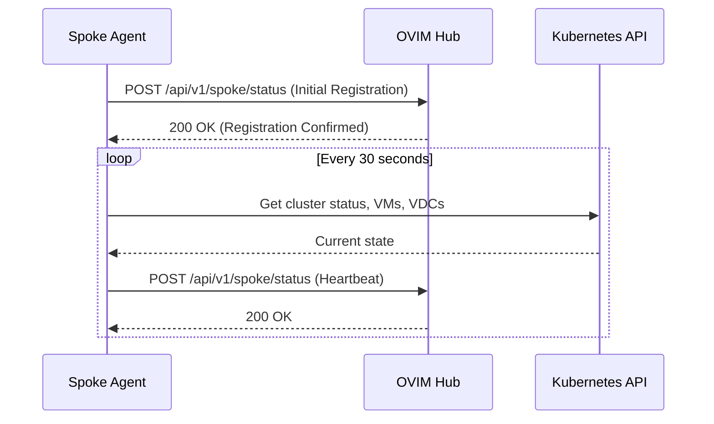
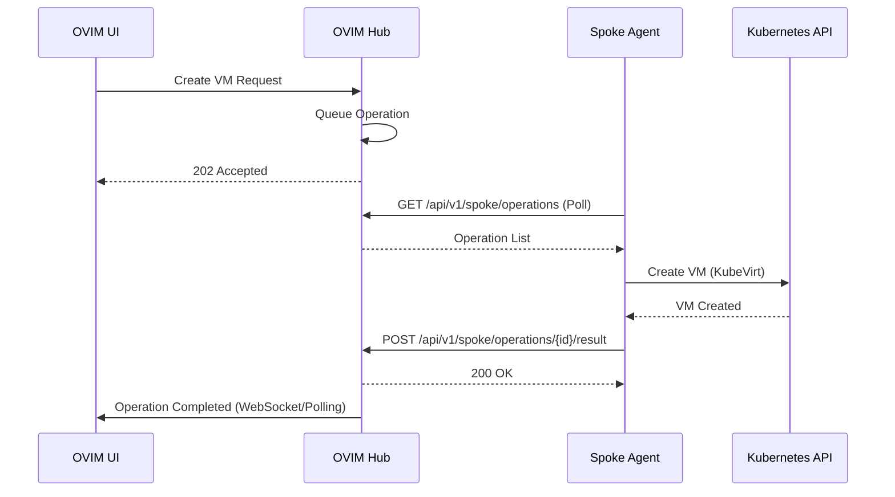
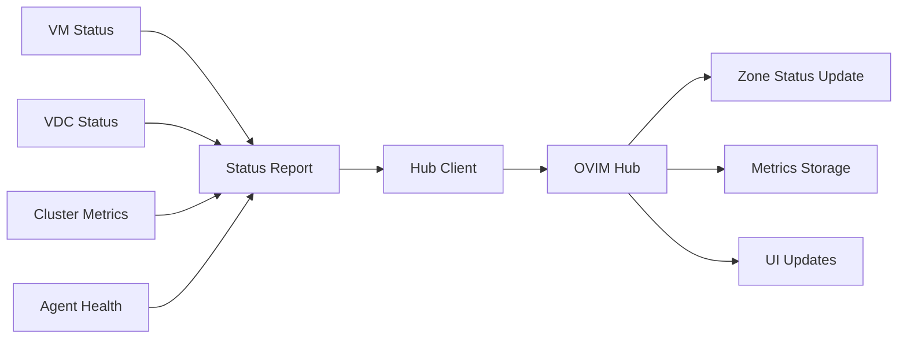

# OVIM Spoke Agent Architecture

The OVIM Spoke Agent is a distributed component that runs on remote Kubernetes clusters to provide local VM management capabilities. It acts as a bridge between the central OVIM Hub and the local cluster resources, enabling decentralized virtualization management.

## Table of Contents

- [Overview](#overview)
- [Architecture Components](#architecture-components)
- [Communication Flow](#communication-flow)
- [Deployment Model](#deployment-model)
- [Component Details](#component-details)
- [Configuration](#configuration)
- [Operations and Lifecycle](#operations-and-lifecycle)
- [Security Considerations](#security-considerations)
- [Monitoring and Health](#monitoring-and-health)

## Overview

The Spoke Agent implements a hub-and-spoke architecture where:
- **Hub**: Central OVIM backend server that coordinates operations across multiple clusters
- **Spoke**: Local agent deployed on each managed cluster that executes operations locally

```
                         ┌─────────────────┐      
                         │    OVIM  Hub    │      
         ┌───────────────┤    (Backend)    │─────────────────┐
         │               └─────────────────┘                 │
         │                         │                         │
         ▼                         ▼                         ▼
┌─────────────────┐       ┌─────────────────┐       ┌─────────────────┐
│    Hub Agent    │       │   Spoke Agent   │  ...  │   Spoke Agent   │
│  (Hub Cluster)  │       │   (Cluster 1)   │  ...  │   (Cluster N)   │
└─────────────────┘       └─────────────────┘       └─────────────────┘
         │                         │                         │
         ▼                         ▼                         ▼
┌─────────────────┐       ┌─────────────────┐       ┌─────────────────┐
│  KubeVirt VMs   │       │  KubeVirt VMs   │  ...  │  KubeVirt VMs   │
│     (Local)     │       │     (Local)     │  ...  │     (Local)     │
└─────────────────┘       └─────────────────┘       └─────────────────┘
```

## Architecture Components

### Core Agent Components

1. **Main Agent (`/pkg/spoke/agent/agent.go`)**
   - Central coordinator for all spoke operations
   - Manages component lifecycle and coordination
   - Handles graceful startup and shutdown

2. **Hub Client (`/pkg/spoke/hub/client.go`)**
   - HTTP REST client for communicating with OVIM Hub
   - Implements authentication, retry logic, and connection management
   - Handles operation polling and status reporting

3. **VM Manager (`/pkg/spoke/vm/manager.go`)**
   - Manages KubeVirt VM lifecycle (create, start, stop, delete)
   - Handles VM status monitoring and reporting
   - Interfaces with Kubernetes API for VM operations

4. **VDC Manager** _(Planned)_
   - Manages Kubernetes namespaces representing Virtual Data Centers
   - Handles resource quotas and network policies
   - Manages VDC lifecycle and isolation

5. **Operation Processor (`/pkg/spoke/operations/processor.go`)**
   - Processes operations received from the hub
   - Routes operations to appropriate handlers
   - Manages operation execution and result reporting

6. **Health Reporter (`/pkg/spoke/health/reporter.go`)**
   - Monitors agent and cluster health
   - Reports health status to the hub
   - Performs self-diagnostics and recovery

7. **Metrics Collector** _(Planned)_
   - Collects cluster resource metrics
   - Monitors VM and VDC resource usage
   - Provides capacity and utilization data

8. **Template Manager** _(Planned)_
   - Caches VM templates locally
   - Synchronizes templates from hub
   - Validates template compatibility

### Support Components

9. **Configuration Manager (`/pkg/spoke/config/config.go`)**
   - Loads configuration from environment variables and files
   - Handles dynamic configuration updates
   - Validates configuration parameters

10. **Local API Server** _(Planned)_
    - Provides debugging and diagnostic endpoints
    - Exposes agent metrics and status
    - Enables local troubleshooting

11. **Event Recorder** _(Planned)_
    - Records events to Kubernetes event system
    - Provides audit trail for operations
    - Integrates with OVIM event system

## Communication Flow

### Agent Registration and Heartbeat



### Operation Execution



### Status Reporting



## Deployment Model

### Kubernetes Deployment

The spoke agent is deployed as a Kubernetes Deployment with the following characteristics:

```yaml
apiVersion: apps/v1
kind: Deployment
metadata:
  name: ovim-spoke-agent
  namespace: ovim-system
spec:
  replicas: 1  # Single instance per cluster
  selector:
    matchLabels:
      app: ovim-spoke-agent
  template:
    spec:
      serviceAccountName: ovim-spoke-agent
      containers:
      - name: agent
        image: quay.io/ovim/spoke-agent:latest
        env:
        - name: OVIM_HUB_ENDPOINT
          value: "https://ovim-hub.example.com"
        - name: OVIM_CLUSTER_ID
          value: "cluster-01"
        resources:
          requests:
            memory: "128Mi"
            cpu: "100m"
          limits:
            memory: "512Mi"
            cpu: "500m"
```

### RBAC Requirements

The agent requires specific Kubernetes permissions:

```yaml
apiVersion: rbac.authorization.k8s.io/v1
kind: ClusterRole
metadata:
  name: ovim-spoke-agent
rules:
# KubeVirt VM management
- apiGroups: ["kubevirt.io"]
  resources: ["virtualmachines", "virtualmachineinstances"]
  verbs: ["*"]
# Namespace management for VDCs
- apiGroups: [""]
  resources: ["namespaces"]
  verbs: ["get", "list", "watch", "create", "delete"]
# Resource quota management
- apiGroups: [""]
  resources: ["resourcequotas", "limitranges"]
  verbs: ["*"]
# Node and cluster information
- apiGroups: [""]
  resources: ["nodes"]
  verbs: ["get", "list", "watch"]
# Metrics and monitoring
- apiGroups: ["metrics.k8s.io"]
  resources: ["nodes", "pods"]
  verbs: ["get", "list"]
```

## Component Details

### Main Agent Lifecycle

```go
type Agent struct {
    config           *config.SpokeConfig
    hubClient        spoke.HubClient
    vmManager        spoke.VMManager
    vdcManager       spoke.VDCManager
    metricsCollector spoke.MetricsCollector
    healthReporter   spoke.HealthReporter
    templateManager  spoke.TemplateManager
    processor        spoke.OperationProcessor
    localAPI         spoke.LocalAPIServer

    // Internal state
    status      spoke.AgentStatus
    startTime   time.Time
    lastContact time.Time
}
```

**Startup Sequence:**
1. Load configuration from environment and files
2. Initialize logging and metrics
3. Create and configure all component managers
4. Establish connection to OVIM Hub
5. Start background goroutines for periodic tasks
6. Begin operation polling and processing

**Shutdown Sequence:**
1. Receive shutdown signal (SIGINT/SIGTERM)
2. Stop accepting new operations
3. Complete in-flight operations
4. Disconnect from hub gracefully
5. Clean up resources and exit

### Hub Client Communication

The `HTTPClient` implements resilient communication patterns:

**Connection Management:**
- Automatic reconnection with exponential backoff
- TLS configuration with certificate validation
- Authentication token management
- Connection pooling and keep-alive

**Operation Patterns:**
- **Push**: Agent sends status reports to hub
- **Pull**: Agent polls hub for pending operations
- **Request-Response**: Synchronous API calls for specific data

**Error Handling:**
- Automatic retry with jitter
- Circuit breaker pattern for failing endpoints
- Graceful degradation when hub is unavailable
- Local caching of critical data

### VM Manager Interface

```go
type VMManager interface {
    CreateVM(ctx context.Context, req *VMCreateRequest) (*VMStatus, error)
    DeleteVM(ctx context.Context, namespace, name string) error
    StartVM(ctx context.Context, namespace, name string) error
    StopVM(ctx context.Context, namespace, name string) error
    GetVMStatus(ctx context.Context, namespace, name string) (*VMStatus, error)
    ListVMs(ctx context.Context) ([]VMStatus, error)
    WatchVMs(ctx context.Context) (<-chan VMStatus, error)
}
```

**Key Responsibilities:**
- KubeVirt VM lifecycle management
- Status monitoring and event handling
- Resource allocation and validation
- Template-based VM creation
- Networking and storage configuration

### Operation Processing

Operations are processed through a pipeline:

1. **Reception**: Operations received from hub via polling
2. **Validation**: Verify operation structure and permissions
3. **Routing**: Route to appropriate handler based on operation type
4. **Execution**: Execute operation locally (VM creation, etc.)
5. **Result**: Report success/failure back to hub

**Operation Types:**
- `VMCreate`: Create new virtual machine
- `VMDelete`: Delete existing virtual machine
- `VMStart`: Start stopped virtual machine
- `VMStop`: Stop running virtual machine
- `VDCCreate`: Create new Virtual Data Center
- `VDCDelete`: Delete Virtual Data Center
- `TemplateSync`: Synchronize VM templates
- `ConfigUpdate`: Update agent configuration

## Configuration

### Environment Variables

| Variable | Description | Default | Required |
|----------|-------------|---------|----------|
| `OVIM_AGENT_ID` | Unique agent identifier | auto-generated | No |
| `OVIM_CLUSTER_ID` | Kubernetes cluster identifier | - | Yes |
| `OVIM_ZONE_ID` | OVIM zone identifier | same as cluster_id | No |
| `OVIM_HUB_ENDPOINT` | OVIM Hub API endpoint | - | Yes |
| `OVIM_HUB_TOKEN` | Authentication token | - | Yes |
| `OVIM_HUB_TLS_INSECURE` | Skip TLS verification | false | No |
| `OVIM_LOG_LEVEL` | Logging level | info | No |
| `OVIM_METRICS_ENABLED` | Enable metrics collection | true | No |
| `OVIM_HEALTH_CHECK_INTERVAL` | Health check interval | 30s | No |

### Configuration Validation

The agent validates configuration at startup:
- Required fields are present
- URLs are well-formed
- Authentication credentials are valid
- Kubernetes connectivity is available
- Required permissions are granted

## Operations and Lifecycle

### Agent States

```go
type AgentStatus int

const (
    AgentStatusHealthy AgentStatus = iota
    AgentStatusDegraded
    AgentStatusUnhealthy
    AgentStatusConnecting
    AgentStatusDisconnected
)
```

**State Transitions:**
- `Connecting` → `Healthy`: Successful hub connection and registration
- `Healthy` → `Degraded`: Some components failing but core functionality intact
- `Degraded` → `Unhealthy`: Multiple component failures
- `Healthy/Degraded` → `Disconnected`: Loss of hub connectivity
- `Disconnected` → `Connecting`: Attempting to reconnect

### Health Monitoring

The agent continuously monitors:
- **Hub Connectivity**: Regular heartbeat and operation polling
- **Kubernetes API**: Cluster API responsiveness
- **Component Health**: Individual manager status
- **Resource Availability**: Memory, CPU, storage capacity
- **Operation Success Rate**: Recent operation failure rate

### Error Recovery

**Automatic Recovery:**
- Restart failed components
- Reconnect to hub with exponential backoff
- Retry failed operations with circuit breaker
- Clean up orphaned resources

**Manual Recovery:**
- Restart agent pod
- Reset agent configuration
- Clear local cache
- Force re-registration with hub

## Security Considerations

### Authentication and Authorization

- **Hub Authentication**: Mutual TLS or bearer token authentication
- **Kubernetes RBAC**: Minimal required permissions
- **Service Account**: Dedicated service account with limited scope
- **Network Policies**: Restrict agent network access

### Data Protection

- **Secrets Management**: Use Kubernetes secrets for sensitive data
- **Encryption**: TLS for all hub communication
- **Audit Logging**: Record all administrative operations
- **Access Control**: Namespace-level isolation for VDCs

### Security Best Practices

- Run as non-root user
- Use read-only root filesystem
- Enable security contexts and pod security standards
- Regular security updates and vulnerability scanning
- Network segmentation and firewall rules

## Monitoring and Health

### Metrics Collection

The agent exposes metrics for monitoring:
- **Agent Metrics**: Health, uptime, operation count
- **Hub Communication**: Connection status, latency, error rate
- **VM Metrics**: Count, status, resource usage
- **Cluster Metrics**: Node status, resource capacity
- **Operation Metrics**: Success rate, duration, queue depth

### Health Endpoints

```
GET /health/live     - Liveness probe (agent running)
GET /health/ready    - Readiness probe (ready to serve)
GET /health/status   - Detailed health status
GET /metrics         - Prometheus metrics
```

### Alerting

Key alerts to monitor:
- Agent pod not ready
- Hub connectivity lost
- High operation failure rate
- Resource capacity warnings
- Component health degradation
- Kubernetes API errors

### Troubleshooting

**Common Issues:**
1. **Hub Connection Failures**: Check network, DNS, certificates
2. **Permission Errors**: Verify RBAC configuration
3. **Resource Conflicts**: Check namespace isolation and quotas
4. **VM Creation Failures**: Validate templates and resources
5. **High Memory Usage**: Monitor metrics collection and caching

**Debug Tools:**
- Agent logs: `kubectl logs -n ovim-system deployment/ovim-spoke-agent`
- Local API: Port-forward to debug endpoints
- Kubernetes events: Check for system-level issues
- Hub logs: Correlate with hub-side errors

---

## Implementation Status

**Currently Implemented:**
- ✅ Basic agent structure and interfaces
- ✅ Configuration management
- ✅ Hub client with HTTP communication
- ✅ VM manager skeleton
- ✅ Operation processor framework
- ✅ Health reporter basics

**Planned Features:**
- 🚧 Complete VM lifecycle management
- 🚧 VDC namespace management
- 🚧 Metrics collection and reporting
- 🚧 Template caching and validation
- 🚧 Local API server for debugging
- 🚧 Advanced error recovery
- 🚧 Event recording integration

**Version:** v1.0.0 (Initial Release)