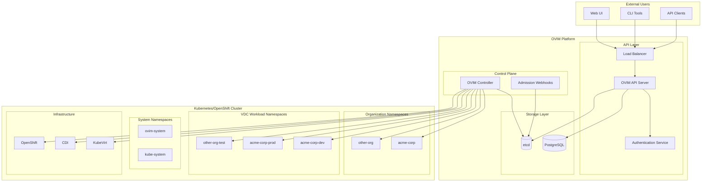
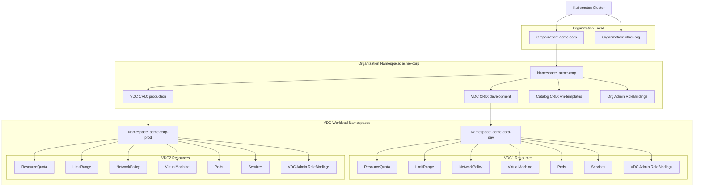
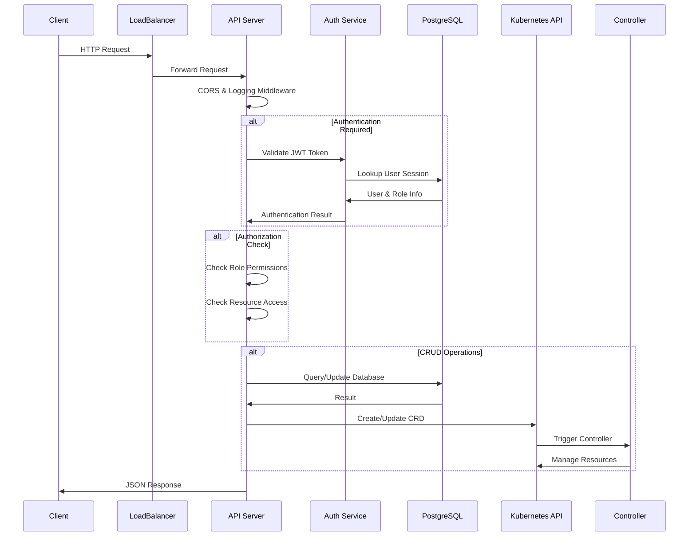
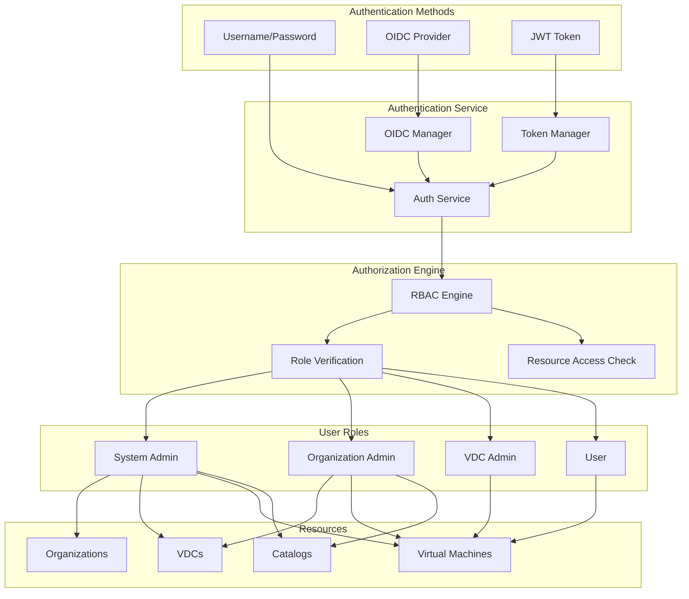
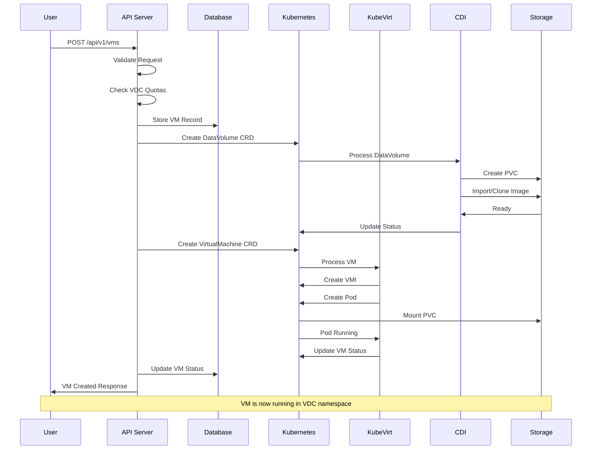
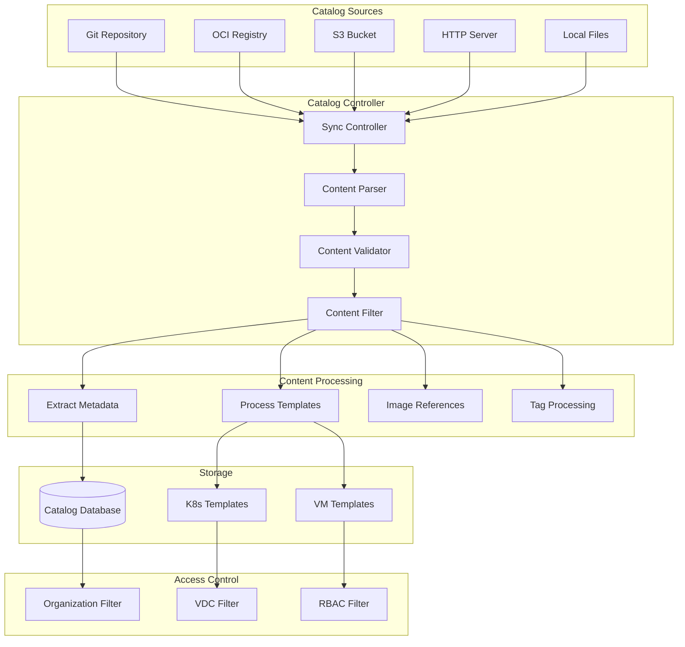
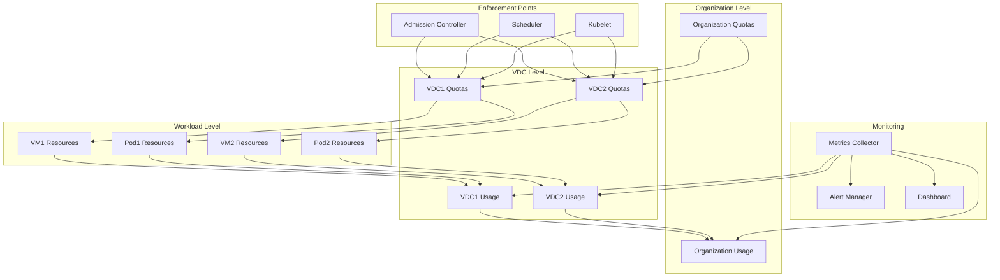
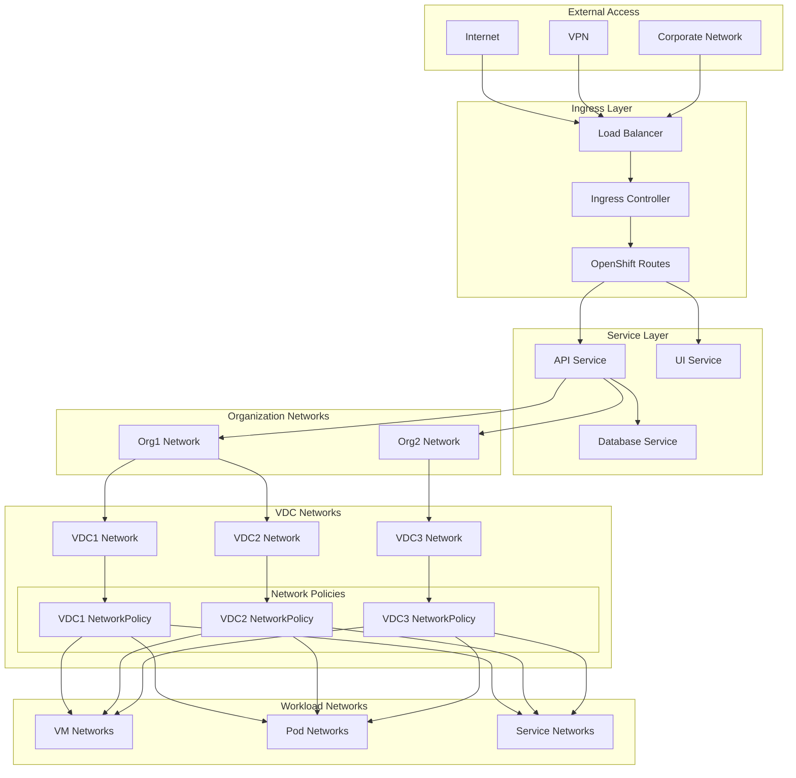
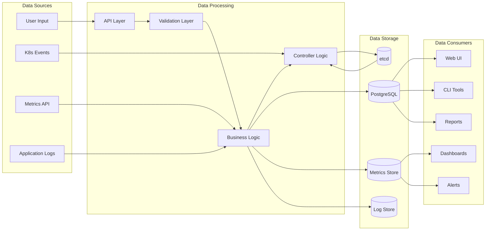

# OVIM Architecture Diagrams

## Overall System Architecture

## Multi-Tenant Resource Hierarchy

## Controller Architecture

```mermaid
graph TB
    subgraph "Controller Manager"
        MGR[Controller Manager]
        CACHE[Shared Cache]
        CLIENT[Kubernetes Client]
    end

    subgraph "Controllers"
        ORG_CTRL[Organization Controller]
        VDC_CTRL[VDC Controller]
        VM_CTRL[VM Controller]
        CAT_CTRL[Catalog Controller]
        METRICS_CTRL[Metrics Controller]
        RBAC_CTRL[RBAC Sync Controller]
    end

    subgraph "Watched Resources"
        ORG_CRD[Organization CRDs]
        VDC_CRD[VDC CRDs]
        VM_CRD[VM CRDs]
        CAT_CRD[Catalog CRDs]
        NS[Namespaces]
        QUOTA[ResourceQuotas]
        RBAC[RoleBindings]
    end

    subgraph "Managed Resources"
        CREATE_NS[Create Namespaces]
        CREATE_QUOTA[Create ResourceQuotas]
        CREATE_RBAC[Create RoleBindings]
        CREATE_NP[Create NetworkPolicies]
        SYNC_STATUS[Update Status]
        COLLECT_METRICS[Collect Metrics]
    end

    MGR --> ORG_CTRL
    MGR --> VDC_CTRL
    MGR --> VM_CTRL
    MGR --> CAT_CTRL
    MGR --> METRICS_CTRL
    MGR --> RBAC_CTRL

    MGR --> CACHE
    MGR --> CLIENT

    ORG_CTRL --> ORG_CRD
    VDC_CTRL --> VDC_CRD
    VM_CTRL --> VM_CRD
    CAT_CTRL --> CAT_CRD
    METRICS_CTRL --> NS
    RBAC_CTRL --> RBAC

    ORG_CTRL --> CREATE_NS
    ORG_CTRL --> CREATE_RBAC
    VDC_CTRL --> CREATE_NS
    VDC_CTRL --> CREATE_QUOTA
    VDC_CTRL --> CREATE_RBAC
    VDC_CTRL --> CREATE_NP
    VM_CTRL --> SYNC_STATUS
    METRICS_CTRL --> COLLECT_METRICS
    RBAC_CTRL --> CREATE_RBAC
```

## API Request Flow

## Authentication & Authorization Flow

## VM Provisioning Workflow

## Catalog Content Management

## Resource Quota Management

## Network Architecture

## Data Flow Architecture

These diagrams provide a comprehensive visual representation of the OVIM architecture, showing how all components interact and how data flows through the system. Each diagram focuses on a specific aspect of the architecture while maintaining the overall context of the multi-tenant virtual infrastructure management platform.