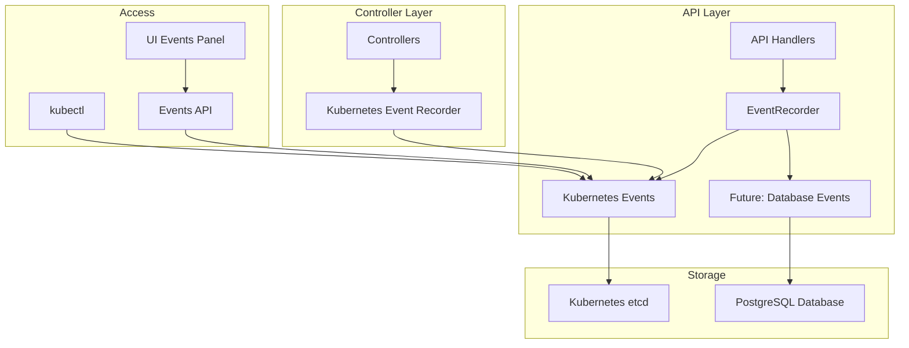

# OVIM Event Recording System

## Overview

The OVIM event recording system provides comprehensive audit trails and operational insights through both Kubernetes native events and API-level activity tracking. This dual-layer approach ensures complete visibility into system operations for compliance, troubleshooting, and monitoring purposes.

## Architecture

### Two-Layer Event System

1. **Kubernetes Events**: Native Kubernetes events for cluster-level operations
2. **API Events**: Application-level events for business logic operations



## Components

### EventRecorder (`pkg/api/event_recorder.go`)

Central event recording component that wraps the Kubernetes event recorder.

#### Key Features:
- **Kubernetes Integration**: Direct integration with Kubernetes event system
- **Object Association**: Associates events with Kubernetes objects when available
- **Extensible Design**: Ready for future database-based event storage
- **Safe Operations**: Null-safe event recording

#### Methods:
```go
// Core recording method
func (er *EventRecorder) Record(object client.Object, eventType, reason, message string)

// Organization events
func (er *EventRecorder) RecordOrganizationCreated(ctx context.Context, orgID string, username string)
func (er *EventRecorder) RecordOrganizationUpdated(ctx context.Context, orgID string, username string)
func (er *EventRecorder) RecordOrganizationDeleted(ctx context.Context, orgID string, username string)
func (er *EventRecorder) RecordOrganizationReconcileForced(ctx context.Context, orgID string, username string)

// VDC events
func (er *EventRecorder) RecordVDCCreated(ctx context.Context, vdcID string, orgID string, username string)
func (er *EventRecorder) RecordVDCUpdated(ctx context.Context, vdcID string, orgID string, username string)
func (er *EventRecorder) RecordVDCDeleted(ctx context.Context, vdcID string, orgID string, username string)
```

### Events API Handler (`pkg/api/events.go`)

REST API for querying and retrieving Kubernetes events.

#### Endpoints:

1. **GET /api/v1/events**
   - Paginated event listing with filtering
   - Query parameters: `limit`, `page`, `type`, `component`, `namespace`
   - Maximum limit: 200 events per request

2. **GET /api/v1/events/recent**
   - Recent events summary
   - Query parameters: `limit` (max 50)
   - Optimized for dashboard display

#### Response Format:
```json
{
  "events": [
    {
      "id": "event-uid",
      "name": "event-name",
      "namespace": "ovim-system",
      "type": "Normal",
      "reason": "Created",
      "message": "Organization created successfully",
      "component": "ovim-api",
      "involved_object_kind": "Organization",
      "involved_object_name": "my-company",
      "first_timestamp": "2024-01-15T10:30:00Z",
      "last_timestamp": "2024-01-15T10:30:00Z",
      "count": 1
    }
  ],
  "total_count": 1,
  "page": 1,
  "page_size": 50
}
```

## Event Categories

### Organization Events

| Event Type | Reason | Description |
|------------|--------|-------------|
| Normal | OrganizationCreated | New organization created by admin |
| Normal | OrganizationUpdated | Organization configuration updated |
| Normal | OrganizationDeleted | Organization removed from system |
| Normal | ReconcileForced | Manual reconciliation triggered |

### VDC Events

| Event Type | Reason | Description |
|------------|--------|-------------|
| Normal | VDCCreated | New Virtual Data Center created |
| Normal | VDCUpdated | VDC configuration or resources updated |
| Normal | VDCDeleted | VDC removed from organization |
| Warning | QuotaExceeded | Resource quota limits exceeded |
| Warning | CreationFailed | VDC creation failed due to constraints |

### VM Events

| Event Type | Reason | Description |
|------------|--------|-------------|
| Normal | VMCreated | Virtual machine successfully created |
| Normal | VMStarted | VM power state changed to running |
| Normal | VMStopped | VM power state changed to stopped |
| Normal | VMDeleted | VM removed from system |
| Warning | ProvisioningFailed | VM creation failed in KubeVirt |
| Warning | StartupFailed | VM failed to start due to resource constraints |

## Integration Points

### API Server Integration

Event recording is automatically integrated into API handlers:

```go
// In organization_handlers.go
if h.eventRecorder != nil {
    h.eventRecorder.RecordOrganizationCreated(ctx, orgID, username)
}

// In vdc_handlers.go
if h.eventRecorder != nil {
    h.eventRecorder.RecordVDCCreated(ctx, vdcID, req.OrgID, username)
}
```

### Server Initialization

Event recorder is initialized during server startup:

```go
// Create event recorder
var eventRecorder *EventRecorder
if recorder != nil && k8sClient != nil {
    eventRecorder = NewEventRecorder(recorder, k8sClient)
    klog.Infof("API Event recorder initialized")
} else {
    klog.Warningf("Event recorder or k8s client not available, API events will not be recorded")
}
```

### Handler Setup

Handlers receive event recorder through dependency injection:

```go
orgHandlers := NewOrganizationHandlers(s.storage, s.k8sClient, s.openshiftClient)
if s.eventRecorder != nil {
    orgHandlers.SetEventRecorder(s.eventRecorder)
}
```

## Security and Access Control

### Authentication Required
- All event API endpoints require valid JWT authentication
- Events are filtered based on user permissions and organization access

### Authorization Levels
- **System Admin**: Access to all events across all namespaces
- **Org Admin**: Access to events within their organization namespace
- **Org User**: Access to events related to their own resources

### Data Privacy
- Events may contain sensitive information (usernames, resource IDs)
- Event retention follows Kubernetes event TTL (default: 1 hour)
- No passwords or tokens are recorded in event messages

## Monitoring and Observability

### Health Checks
- Event API availability checked in `/health` endpoint
- Kubernetes client connectivity verified during startup
- Event recording failures logged but don't block operations

### Metrics Integration
- Event recording success/failure rates
- Event API request patterns
- Most frequent event types and reasons

### Troubleshooting
- Event recording is fail-safe (operations continue if recording fails)
- Detailed logging for event recording issues
- Kubernetes events viewable via `kubectl get events`

## Future Enhancements

### Database Event Storage
Current event methods include placeholders for database storage:
```go
func (er *EventRecorder) RecordOrganizationCreated(ctx context.Context, orgID string, username string) {
    // For API events, we just log since we don't have a client.Object
    // In a real implementation, these could be stored in the database or sent as events
}
```

### Enhanced Event Types
- **Resource utilization events**: Quota warnings, usage thresholds
- **Security events**: Authentication failures, unauthorized access attempts
- **Performance events**: Slow API responses, timeout events
- **Integration events**: External system connectivity, webhook deliveries

### Event Aggregation
- Event correlation and deduplication
- Time-series event analytics
- Automated event pattern detection
- Custom event rules and alerts

## Best Practices

### Event Message Format
- Use clear, descriptive messages
- Include relevant context (user, resource, action)
- Follow consistent naming conventions
- Avoid sensitive information in messages

### Event Types
- Use "Normal" for successful operations
- Use "Warning" for recoverable issues
- Use "Error" for failures requiring attention

### Resource Association
- Always associate events with relevant Kubernetes objects when possible
- Use consistent object naming and labeling
- Maintain object lifecycle consistency

### Performance Considerations
- Event recording is asynchronous where possible
- Bulk operations record summary events rather than individual events
- Event API includes pagination for large result sets
- Consider event retention policies for long-term storage

## Related Documentation

- [Backend API Documentation](backend/README.md#events-api)
- [Controller Events](controller/README.md#event-recording)
- [UI Events Integration](ui/components.md#events-panel)
- [Monitoring and Alerts](../docs/monitoring.md)