# OVIM UI Workflow Diagrams

This document contains comprehensive diagrams showing user workflows, authentication flows, component interactions, and system processes within the OVIM frontend application.

## Application Flow Overview

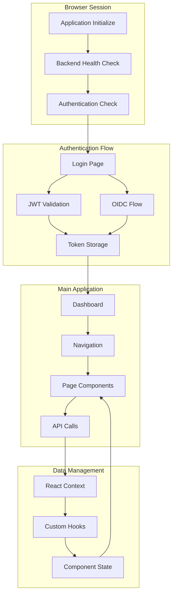

## User Authentication Flows

### Username/Password Authentication

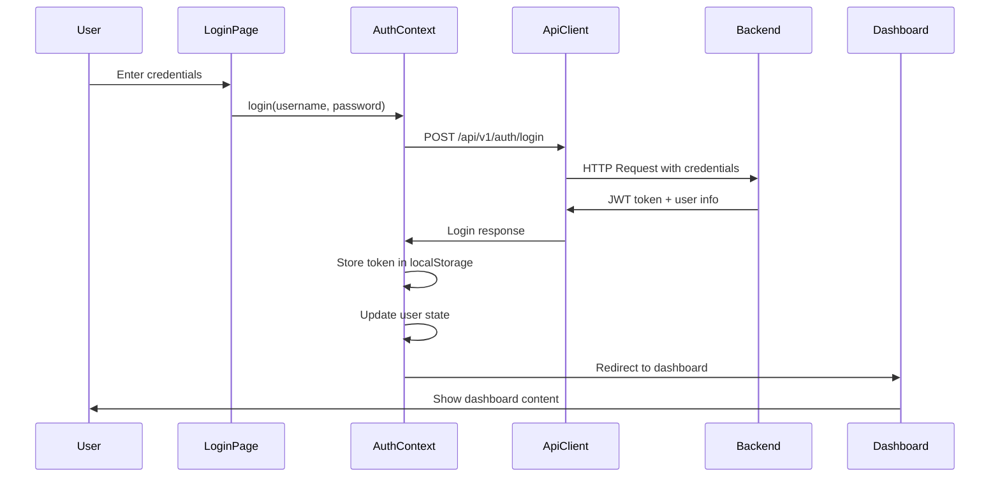

### OIDC Authentication Flow

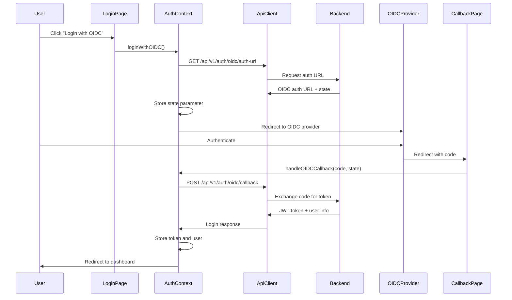

## Role-Based Navigation Flow

```mermaid
graph TD
    subgraph "Authentication"
        LOGIN[User Login]
        ROLE_CHECK[Determine User Role]
    end

    subgraph "System Admin Navigation"
        SA_DASH[System Dashboard]
        SA_ORGS[Organizations Management]
        SA_USERS[User Management]
        SA_VDC[All VDCs]
        SA_VM[All VMs]
        SA_CATALOG[Global Catalog]
        SA_SETTINGS[System Settings]
    end

    subgraph "Organization Admin Navigation"
        OA_DASH[Organization Dashboard]
        OA_VDC[Organization VDCs]
        OA_VM[Organization VMs]
        OA_CATALOG[Organization Catalog]
        OA_SETTINGS[Org Settings]
    end

    subgraph "VDC Admin Navigation"
        VA_DASH[VDC Dashboard]
        VA_VM[VDC VMs]
        VA_CATALOG[Available Templates]
        VA_SETTINGS[VDC Settings]
    end

    subgraph "User Navigation"
        U_DASH[Personal Dashboard]
        U_VM[Assigned VMs]
        U_CATALOG[Browse Templates]
        U_SETTINGS[Profile Settings]
    end

    LOGIN --> ROLE_CHECK

    ROLE_CHECK -->|System Admin| SA_DASH
    SA_DASH --> SA_ORGS
    SA_DASH --> SA_USERS
    SA_DASH --> SA_VDC
    SA_DASH --> SA_VM
    SA_DASH --> SA_CATALOG
    SA_DASH --> SA_SETTINGS

    ROLE_CHECK -->|Org Admin| OA_DASH
    OA_DASH --> OA_VDC
    OA_DASH --> OA_VM
    OA_DASH --> OA_CATALOG
    OA_DASH --> OA_SETTINGS

    ROLE_CHECK -->|VDC Admin| VA_DASH
    VA_DASH --> VA_VM
    VA_DASH --> VA_CATALOG
    VA_DASH --> VA_SETTINGS

    ROLE_CHECK -->|User| U_DASH
    U_DASH --> U_VM
    U_DASH --> U_CATALOG
    U_DASH --> U_SETTINGS
```

## VM Management Workflow

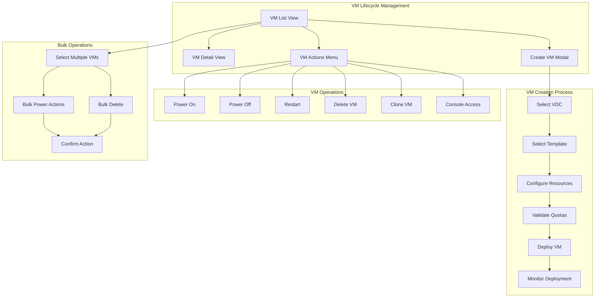

## Organization Management Workflow

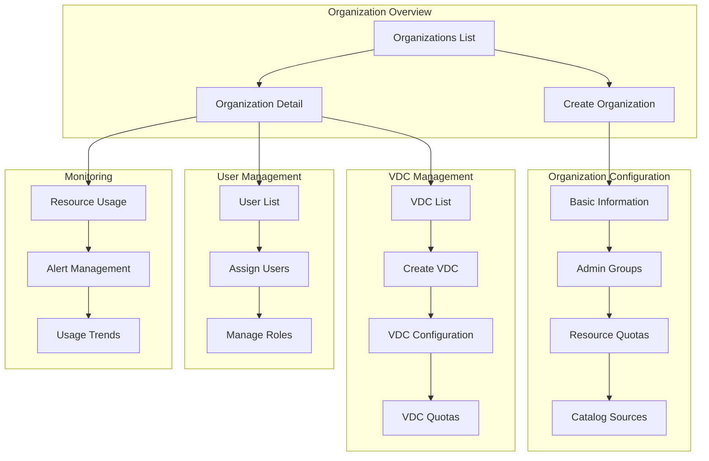

## Component State Management Flow

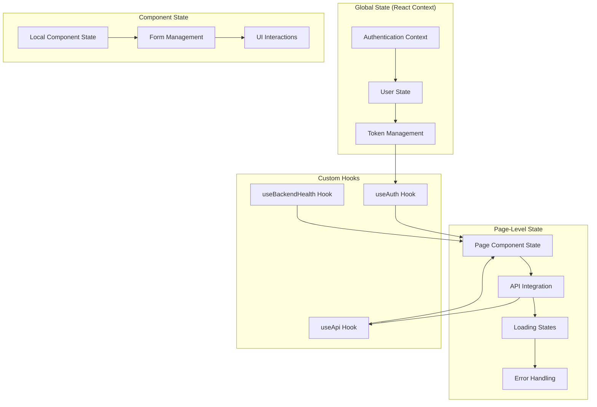

## Data Flow Architecture

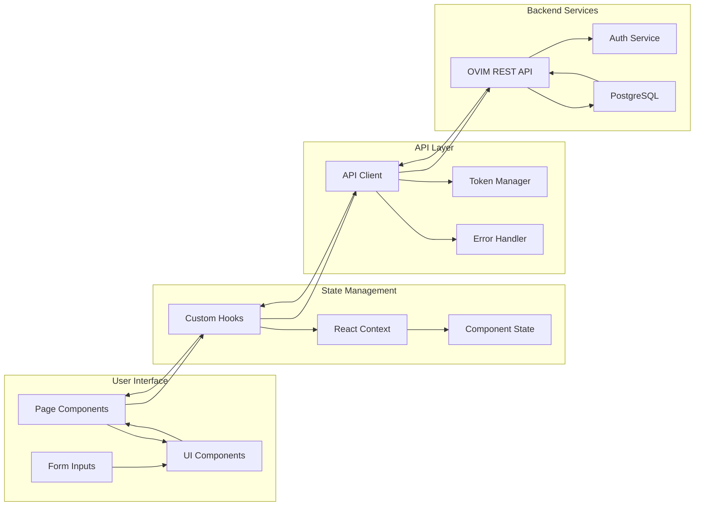

## Error Handling Flow

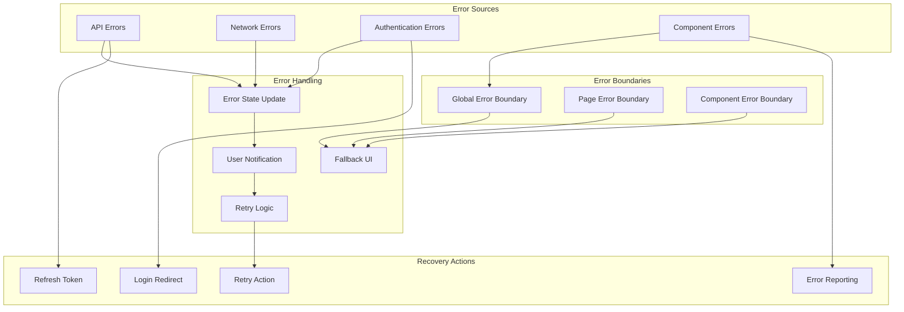

## Real-time Update Flow

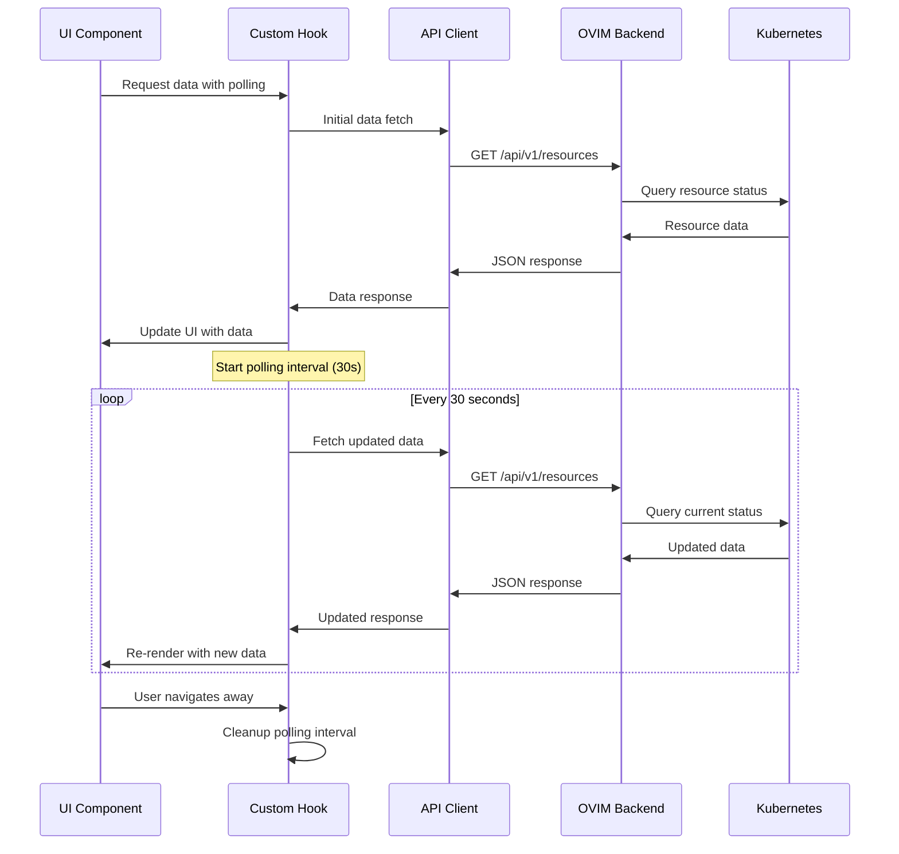

## Deployment and Build Flow

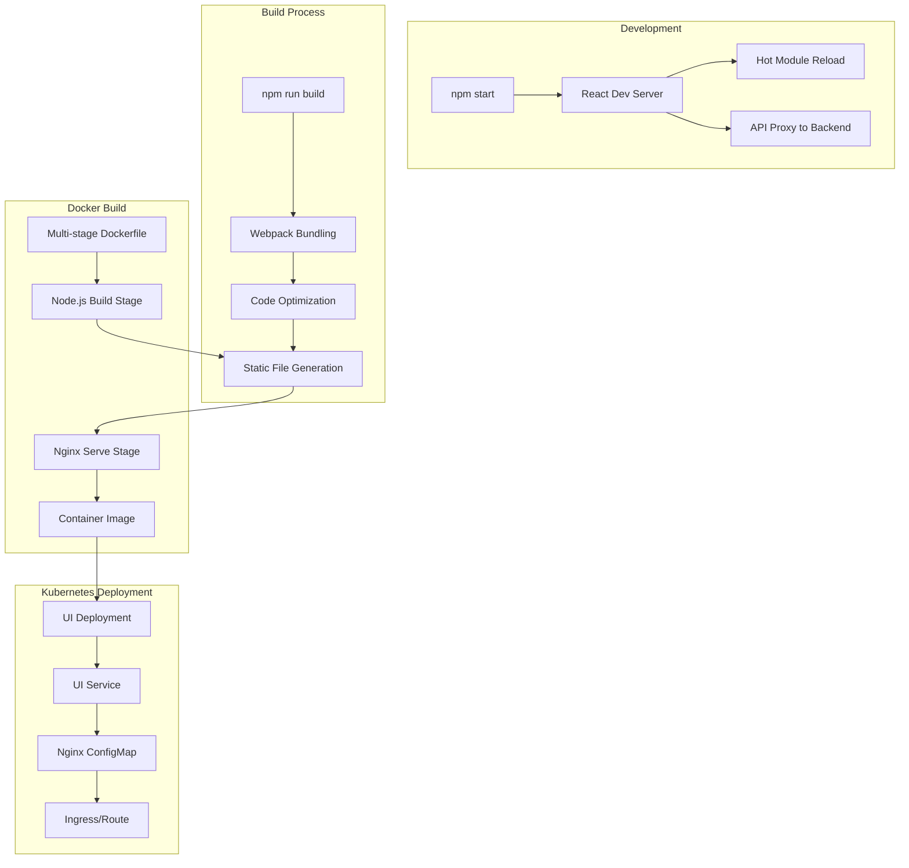

These diagrams provide a comprehensive visual representation of the OVIM UI application's workflows, from user authentication through component interactions to deployment processes.